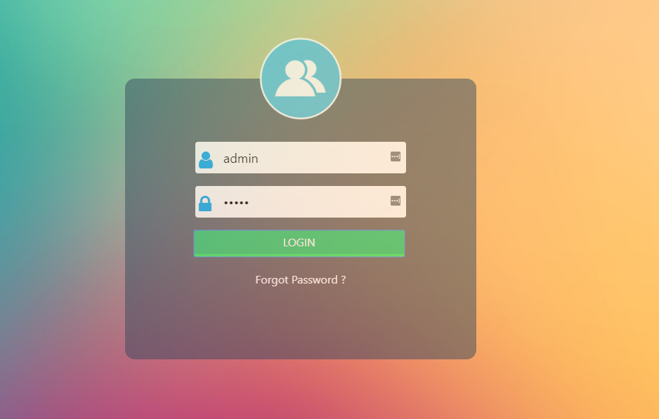

# CrudPhp [WIP]
A simple web application to perform CRUD operation using PHP and Bootstrap 4

Project demo[Only html files] can be accessed at https://asangam.github.io/CrudPhp/



## Instruction To Get Started
- Clone the repository using command using ```$ git clone git@github.com:asangam/CrudPhp.git```
- Go to your downloaded CrudPhp directory using commad ```$ cd CrudPhp``` from command line
- Import the sql file from the folder to your database

- Run your nginx or apache server and mysql
- Run command ```$ php -S localhost:8081```
- And now enter ```http://localhost:8081``` to web browser
- Enter 'admin' for both username and password, it is a Js Client side validation
only used for testing purpose.
- Have Fun 
